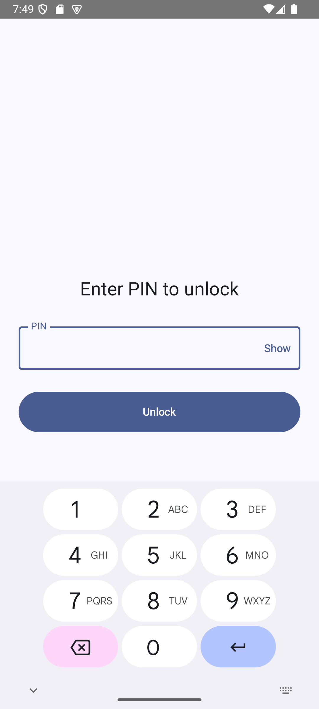
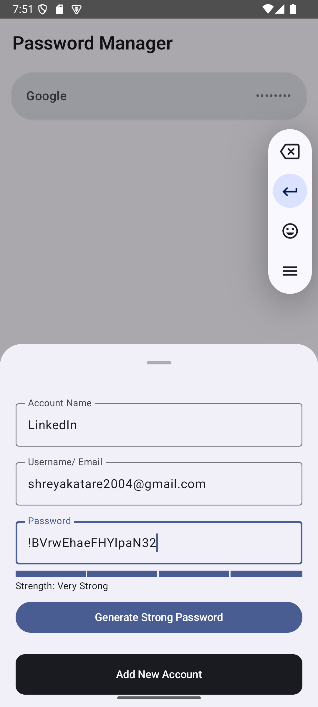
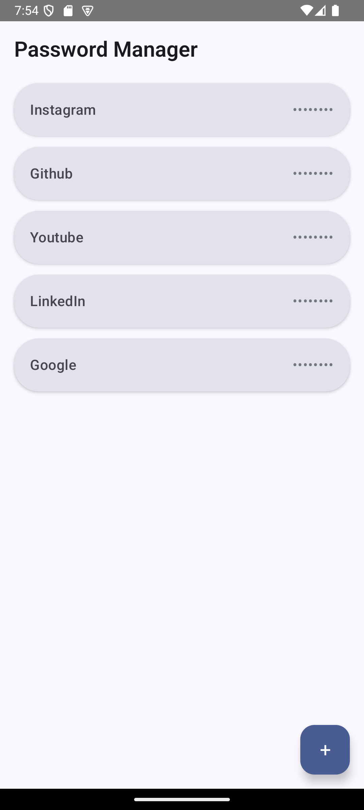
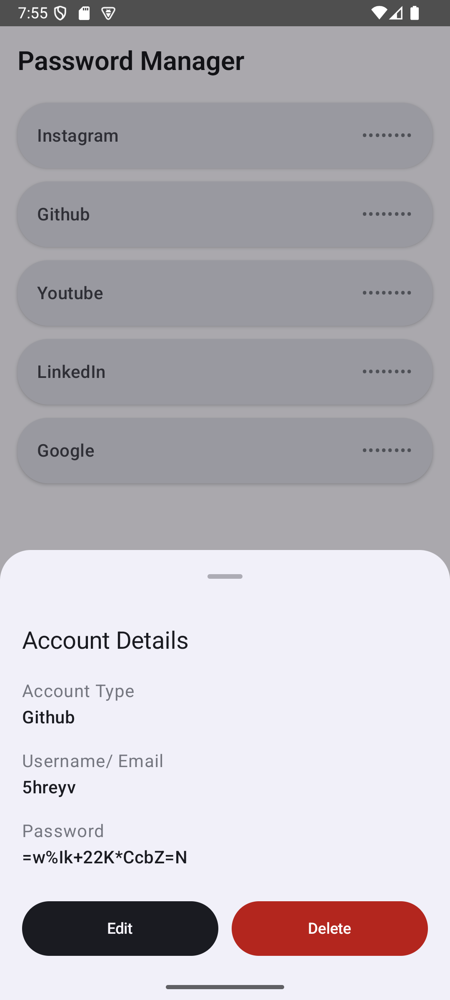

# 🔐 Password Manager App  
A secure and modern Password Manager built with **Kotlin**, **Jetpack Compose**, **Room Database**, and **AES Encryption**.  
Designed to safely store and manage user passwords with biometric authentication, PIN lock, password strength detection, and password generation.

---

## 📱 Features

### ✅ Add Password  
Users can store new credentials by entering:
- Account name (Gmail, Instagram, Facebook, etc.)
- Username / Email
- Password

### ✅ View & Edit Password  
- View decrypted password on demand  
- Edit account name, username/email, and password  

### ✅ Delete Password  
- Securely delete saved entries  

### ✅ Home Screen Password List  
- Clean and minimal UI  
- Shows list of saved accounts  
- Masked password preview  
- Matches the provided Figma design  

---
## 📸 Screenshots

Below are the main screens of the Password Manager app, following the provided Figma design.

### 🔐 PIN Unlock Screen


---

### ➕ Add Password Bottom Sheet


---

### 🏠 Home Screen (Password List)


---

### 📄 Account Details

---

## 🛡️ Security Features

### 🔒 AES Encryption  
All passwords stored in the database are encrypted using AES before saving.  
Decryption happens only when the user views details.

### 👆 Biometric Authentication (Fingerprint / Face Unlock)  
- App shows biometric prompt on launch (if available)  
- Provides seamless and secure unlock experience  

### 🔑 6-Digit PIN Lock (Fallback to Biometric)  
- If biometric fails or is unavailable, users can unlock using PIN  
- First-time users are prompted to set a 6-digit PIN  
- PIN is stored in encrypted form  

---

## ⭐ Bonus Features

### 🧮 Password Strength Meter  
Displays password strength based on:
- Length  
- Use of uppercase/lowercase letters  
- Numbers  
- Special characters  

Strength Levels: **Weak → Medium → Strong → Very Strong**

### ⚙️ Strong Password Generator  
Generates secure random passwords (12–16 characters) using:
- Uppercase  
- Lowercase  
- Digits  
- Symbols  

Automatically fills the password field.

---

## 🧱 Tech Stack

- **Kotlin (2.0)**  
- **Jetpack Compose (Material 3)**  
- **Room Database**  
- **AES Encryption**  
- **BiometricPrompt API**  
- **MVVM Architecture**  
- **Coroutines**  
- **Kotlin Flow / State**  

---

## 📂 Project Structure

```
app/
 └── src/
      └── main/
           ├── java/com/example/passwordmanager/
           │     ├── data/           # Room DB, DAO, Entity, Repository
           │     ├── ui/home/        # Home screen + Add/Edit sheets
           │     ├── ui/lock/        # PIN screen + lock system
           │     ├── util/           # AES Encryption + PIN storage
           │     ├── viewmodel/      # MVVM logic
           │     └── MainActivity.kt # App entry + Biometric + PIN logic
           └── res/
                 ├── values/         # Theme, colors, typography
```

---

## 🚀 How to Run the App

### 1️⃣ Requirements
- Android Studio **Iguana / Koala / Hedgehog / Narwhal (2024.1+)**
- Minimum SDK: **24**
- Kotlin: **2.0+**
- Gradle JDK: **Embedded JBR 21** (Required for Compose)

### 2️⃣ Clone the Repository

```bash
git clone https://github.com/5hreyv/PasswordManager.git
```

### 3️⃣ Open in Android Studio  
Android Studio will automatically sync your Gradle files.

### 4️⃣ Run the App  
Click **Run ▶️** on any device or emulator.

---

## 🧪 Testing the Security Features

### 🔹 Biometric Unlock  
Close the app → reopen → biometric prompt appears.

### 🔹 PIN Unlock  
Use “Use PIN instead” on biometric dialog  
OR launch on a device without biometrics.

### 🔹 Data Security  
Passwords in the Room database appear **fully encrypted**, not readable plaintext.

---

## 📝 Input Validation

The app ensures:
- No empty fields allowed  
- PIN must be exactly 6 digits  
- Incorrect PIN shows error message  
- Invalid password edits are prevented  

---

## 🛠️ Error Handling

- Graceful fallback when biometrics fail  
- Secure storage even if app is killed  
- Handles empty database with a friendly message  
- Defensive Room operations  

---

## 🎨 UI & UX

The user interface closely follows:
- The provided **Figma design**  
- Material 3 guidelines  
- Responsive & clean layout  
- Modern bottom sheets and list components  

---

## 🤝 Acknowledgements

Thanks to Jetpack Compose, Material3, and Android Biometric APIs for enabling a modern and secure Android app experience.

---
